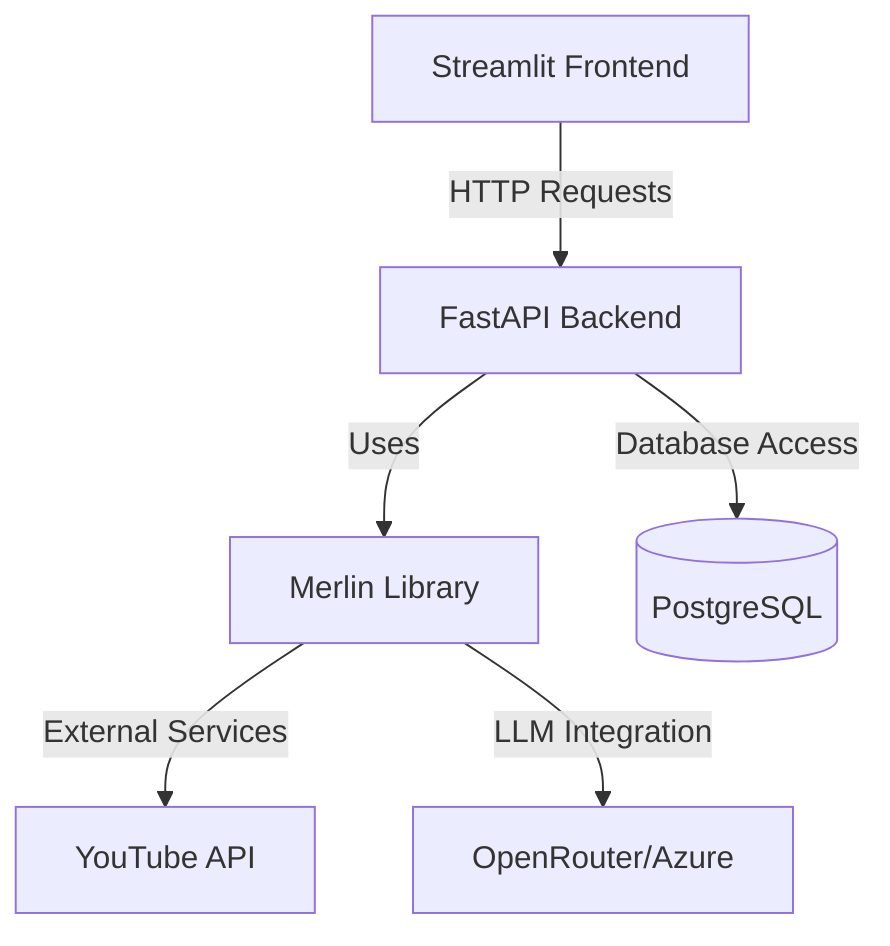

# Merlin YouTube Video Summarizer

A full-stack application that uses AI to summarize YouTube videos, built with FastAPI, Streamlit, and PostgreSQL.

## Architecture



## Features

- YouTube video summarization with AI
- Multi-language support
- Topic and timestamp extraction
- Video search and filtering
- Tag-based organization
- Support for multiple LLM providers

## Components

### Frontend (Streamlit)
- User interface for video processing
- Video search and filtering
- Summary display with topics and timestamps

### Backend (FastAPI)
- RESTful API endpoints
- Database management
- Business logic
- Integration with Merlin library

### Merlin Library
- YouTube data extraction
- Transcript processing
- LLM integration (Azure OpenAI, OpenRouter)
- Multi-language support

## Getting Started

1. Clone the repository:
```bash
git clone https://github.com/yourusername/merlin.git
cd merlin
```

2. Copy the example environment file and fill in your credentials:
```bash
cp .env.example .env
```

3. Start the services with Docker Compose:
```bash
docker-compose up --build
```

4. Access the applications:
- Frontend: http://localhost:8501
- Backend API: http://localhost:8000
- API Documentation: http://localhost:8000/docs

## Development

### Prerequisites
- Python 3.9+
- Docker and Docker Compose
- PostgreSQL
- Azure OpenAI or OpenRouter API key

### Local Development Setup

1. Install dependencies for each component:
```bash
# Backend
cd backend
pip install -r requirements.txt

# Frontend
cd frontend
pip install -r requirements.txt

# Merlin Library
cd merlin
pip install -e .
```

2. Run tests:
```bash
# Backend integration tests
cd backend
pytest tests/integration

# Merlin library unit tests
cd merlin
pytest tests/unit
```

## Environment Variables

Required environment variables (see `.env.example`):
- Database configuration
- Azure OpenAI credentials
- OpenRouter API key
- Frontend configuration

## API Documentation

The API documentation is available at `/docs` when the backend is running. It includes:
- All available endpoints
- Request/response schemas
- Authentication requirements
- Example requests

## Contributing

1. Fork the repository
2. Create a feature branch
3. Commit your changes
4. Push to the branch
5. Create a Pull Request

## License

MIT License - see LICENSE file for details
